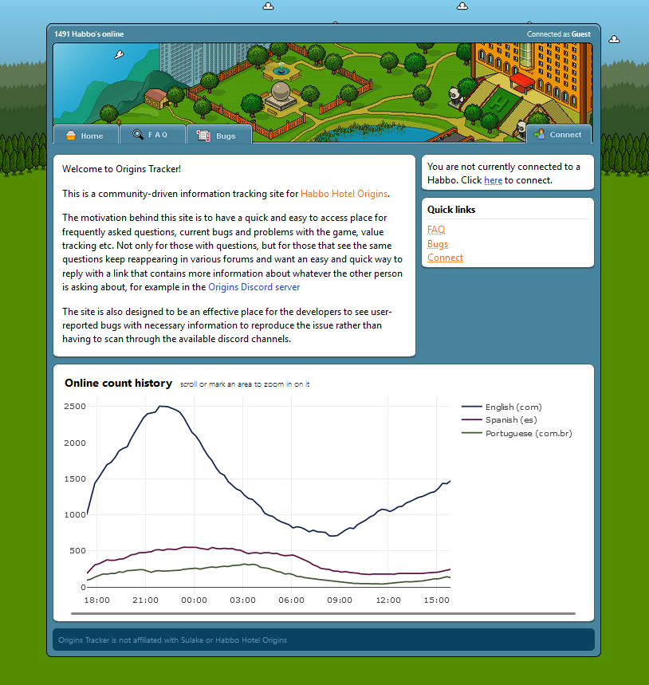

# Community-created
This page is meant to show off cool projects, sites, and communities from other (habbo) creators.
We're always looking to link to more projects! Just have something cool you're working on. 
 

## Habbo Origins fansites
### [1. Origins Tracker](https://origins-tracker.com/)

{ align=right width=450 }

This site tracks a lot of data from Habbo: Origins, like historical player count (Just look at that graph!) and interesting Origins facts.

Origins Tracker is currently developing a work-in-progress bug tracker where you can vote on bugs, leave comments, and share your tests!  There's also a furni value tracker in the works.

<b>Edit: </b>
As of 2025-10-03, Origins Tracker has been abandoned. The link to the website was "origins-tracker (dot) com"
